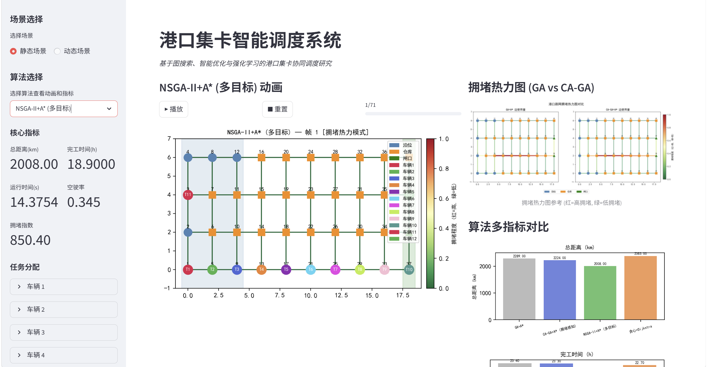
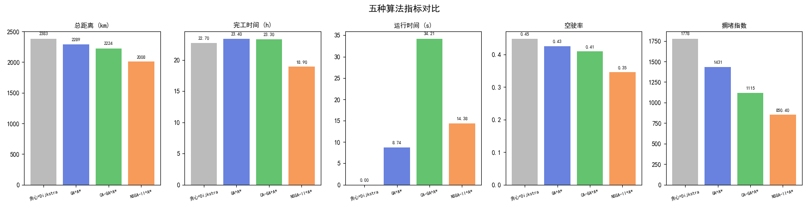
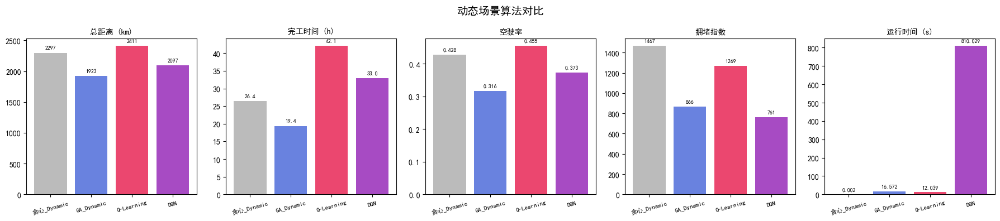
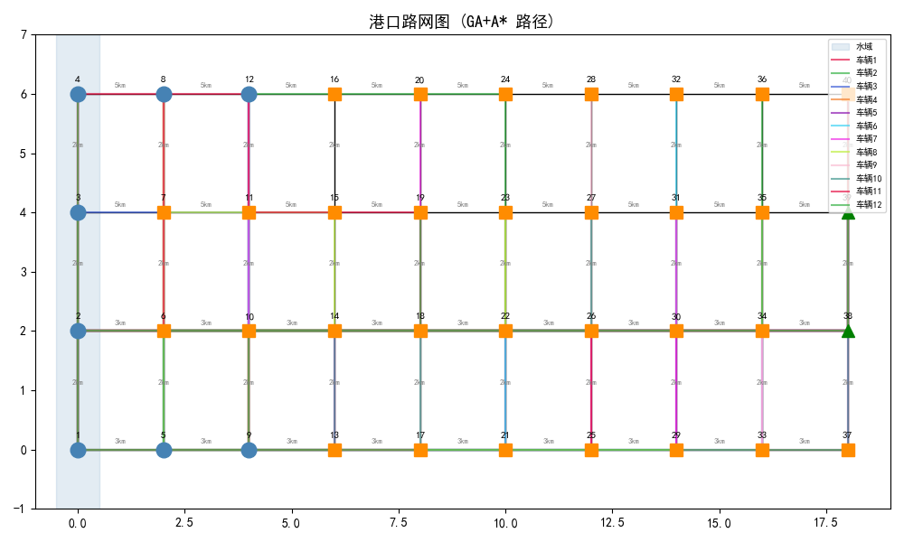
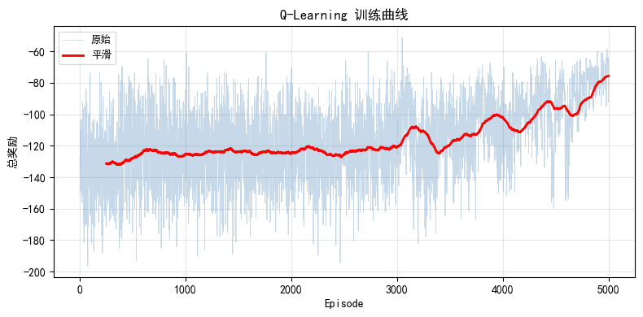
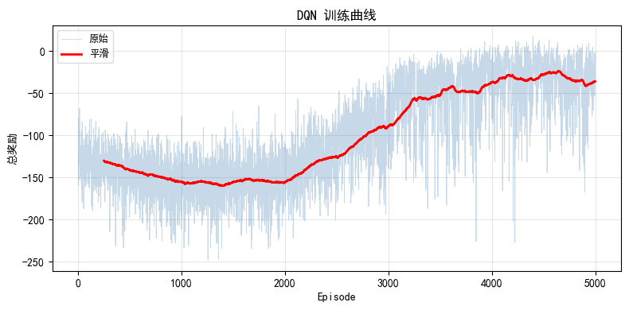

# Port Container Truck Collaborative Dispatching: Graph Search, Intelligent Optimization & Reinforcement Learning


*Streamlit Dashboard — Interactive Schedule Visualization*

## Overview

This project addresses the **Port Container Truck (集卡) Collaborative Dispatching** problem with a **progressive algorithm hierarchy** covering the full technical stack from classical graph search to deep reinforcement learning.

| Layer | Algorithm | Technique | Scenario |
|:---:|:---|:---|:---:|
| 1 | Greedy + Dijkstra | Classical Graph Baseline | Static |
| 2 | GA + A\* | Intelligent Optimization | Static |
| 3 | CA-GA + A\* | Congestion-Aware Enhancement | Static |
| 4 | NSGA-II + A\* | Multi-Objective Optimization | Static |
| 5 | Greedy_Dynamic + Dijkstra | Online Greedy Extension | Dynamic |
| 6 | GA_Dynamic + A\* | Rolling-Horizon Genetic | Dynamic |
| 7 | Q-Learning + A\* | Tabular Reinforcement Learning | Dynamic |
| 8 | DQN + A\* | Deep Reinforcement Learning | Dynamic |



*Overview of eight algorithms across static/dynamic scenarios*

> 🏆 **NSGA-II + A\* leads overall**: total distance reduced by **15.7%**, makespan shortened by **16.7%**, empty ratio reduced by **23.0%**, congestion index reduced by **52.2%** compared to the greedy baseline.

> 🏆 **GA_Dynamic leads in dynamic scenario**: the combination of batch re-optimization and global search performs best in this dynamic setting.

### Port Road Network Model

A **40-node road network** simulating a typical container port, with three functional node types:

- **Berth**: 12 nodes — ship berthing and container loading/unloading
- **Warehouse**: 26 nodes — container stacking and transfer
- **Gate**: 2 nodes — container entry/exit


*Port road network (40 nodes, three functional zones, weighted edges)*

### RL Training Curves


*Q-Learning training curve (5000 episodes, reward converging)*


*DQN training curve (5000 episodes, network stabilizing)*

---

## Installation & Dependencies

```powershell
python -m venv venv
.\venv\Scripts\activate
pip install streamlit matplotlib numpy pymoo ipykernel jupyter torch
```

## QuickStart

```bash
# Launch Jupyter and run the notebook
jupyter notebook main.ipynb
# Launch Streamlit B/S static visualization dashboard
streamlit run app.py
```

**Prerequisite**: Run `main.ipynb` first to generate result data, otherwise the dashboard will prompt "data not found".

---

## 📁 Project Structure

```
Truck Dispatch/
├── app.py                  # Streamlit interactive dashboard
├── assignment.py           # Task assignment algorithms (Greedy / GA / CA-GA)
├── data.py                 # Port network, truck & task data definitions
├── dqn_agent.py            # Deep Q-Network (DQN) agent
├── nsga2_optimizer.py      # NSGA-II multi-objective optimization (pymoo-based)
├── output.py               # Metrics computation & chart export
├── pathfinding.py          # A* / Dijkstra path planning
├── rl_agent.py             # Q-Learning tabular RL agent
├── rl_env.py               # Reinforcement learning environment (PortTruckEnv)
├── main.ipynb              # Main experiment notebook
├── .gitignore              # Git ignore rules
├── requirements.txt        # Python dependency list
│
├── images/                 # Experiment result images
│   ├── 港口路网图_20260606.png
│   ├── 算法对比图_20260606.png
│   ├── 拥堵热力图_20260606.png
│   ├── 收敛曲线图_20260606.png
│   ├── 帕累托前沿_20260606.png
│   ├── 静态算法对比_20260610.png
│   ├── Q表奖励曲线_20260610.png
│   ├── DQN训练曲线_20260610.png
│   ├── Streamlit运行_20260610.png
│   ├── results.json        # Static scenario results (gitignored)
│   └── results_dynamic.json # Dynamic scenario results (gitignored)
│
└── docs/                   # Development docs (gitignored)
```

---

## 📝 Acknowledgements

This project is a course design work for **Algorithm Design and Analysis in Port, Harbor and Logistics** at **Shanghai Maritime University**. It provides a complete experimental framework, yet there remain many directions worth exploring.
Feel free to fork, improve, and contribute!

---

This project is open-sourced under the **MIT License**.
